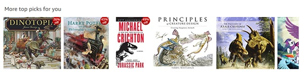

# Movie Recommender

### About This Demo Application
In this Recommendation System Demo, we demonstrate the workings of a model that recommends movies to users, based on what it thinks would rate high on the user’s preference list



Powerful recommendations can be made if recommendations are based not only on the users’ past actions, but also those of all other users. The best examples of this are found on Amazon.com …”Users like you liked the following products”. This type of recommendation is called Collaborative Filtering.  The model we built is one type of collaborative filtering, called Item-Item Similarity, we built a simple model from scratch using pandas.

Please look at the notebook in the rorodata github repository [here](https://github.com/rorodata/recommender-system-demo/blob/master/notebooks/Recommender_System_NB.ipynb) for more details about the modelling and data that went into this effort.

### Productionizing Machine Learning Models Using rorodata 
Below, we discuss how a data scientist can deploy and manage data science models in production using rorodata platform, with just a few simple lines of command from a CLI. In this writeup, we shall illustrate this using Python, a similar write-up for R is on the way. 

There is a lot that goes on behind the scenes in the rorodata platform. It may be hard to appreciate the demo without some understanding of this. For a quick, high level view of the rorodata platform and it's workings, [go here](https://github.com/rorodata/documents/blob/master/about-rorodata.md)


#### Prerequisites
- Download roro client for python3 using `pip install roro`. Note that currently, we only support python 3.5 and above.
- You must have a rorodata platform account, as the models will be deployed on rorodata platform for this example. You may request access [here](http://www.rorodata.com). 

#### Steps (code only)
```
> git clone https://github.com/rorodata/recommender-system-demo.git
> cd recommender-system-demo

# NOTE: edit roro.yml to change project name to name of new project, I am using the project name movie-reco for this example
> roro create movie-reco
Created project: movie-reco

> roro deploy
Deploying project movie-reco. This may take a few moments ...
Restarted one service.
default: https://movie-reco.rorocloud.io/

# run training to create trained model
> roro run python train.py
Started new job ed5906db

#inspect processes, make sure training is finished before using service
> roro ps
JOBID     STATUS    WHEN            TIME     INSTANCE TYPE    CMD
--------  --------  --------------  -------  ---------------  -------------------------------------
f9400f3e  running   1 minute ago    0:01:47  C1               firefly -b 0.0.0.0:8080 train.predict
ed5906db  running   23 seconds ago  0:00:23  C1               python train.py

```


#### Steps (verbose)
1.	Clone the code repository rorodata/credit-scoring-demo (manually or using git) and download the files to a local directory. You will shortly deploy this repository on rorocloud as your own project.
2.	Pick a unique project name for the project you are about to create on the data platform. Remember to keep a short readable name without spaces or special characters (hyphen is ok). 
3.	Edit the roro.yml file, and change the part after project: to match your project name exactly, and save it. The roro.yml is a simple text file that tells the rorodata platform what to do during deployment. You can understand more about the structure and specifications that can go into the YML file here 
4.	You will now deploy code from the local repository you just edited, into production on rorodata platform.  Navigate to the above mentioned repository using command prompt. From here, login to the rorodata platform using roro login from command prompt. You are now using roro client connected to rorodata platform. Send us an email if you run into any issues and we shall help you out quickly
5.	Create your (new) project using the command roro create your-project-name. Remember to us the same name you picked in step 2,3. Remember, this project is the entire machine learning application including its code, all associated tasks and services, persistent data volumes, and ML models. Once done, you can use the command roro projects to view a list of all your projects. Make sure that you can see the project you just created.
6.	You are now ready to deploy your project code to production. From the same command prompt location as in the previous step, type roro deploy and press enter. This When a project is deployed, rorodata takes its cue from the roro.yml file and execute deployment steps one by one. You can see a list / trace of all these steps once roro deploy finishes.
7.	To train the model, run the command roro run python train.py from the same command prompt location. Once this finishes, you have a new model ready to serve prediction requests. rorodata platform helps you save models including model metadata, for every version. To understand how this is done, go here.
8.	Your services should now be ready and serving, with URL endpoints for each service as instructed by you in the roro.yml file.   You can check if the service is running using the command roro ps –a.  In rare cases, the service may fail due to a conflict e.g. if the trained model was not available at the time of launching service. Simple rerun roro deploy from the command prompt and the service will come up 
9.	The rorodata platform services are REST-APIs, and can be accessed using any client service. The easiest way to test this is through our firefly library. You can install this using `pip install firefly-python` and query the service using the same example as in the notebook
10.	Let’s now use the API we created, to predict movies for a user


```
#we will use firefly to call our API, you can use any other library e.g. Requests
> import firefly

#change the below statement to match your prediction service api name
> reco_api=firefly.Client("https://movie-reco.rorocloud.io/")
> print(reco_api.predict(user_id=25))
[{'item_id': 172, 'rating': 4.3662479999862915},
 {'item_id': 117, 'rating': 4.280060547219385},
 {'item_id': 328, 'rating': 4.268231762980369},
 {'item_id': 313, 'rating': 4.257574870784335},
 {'item_id': 15, 'rating': 4.251003373398124},
 {'item_id': 748, 'rating': 4.249858927495112},
 {'item_id': 294, 'rating': 4.240991333210962},
 {'item_id': 237, 'rating': 4.205707885247557},
 {'item_id': 22, 'rating': 4.205464728287706},
 {'item_id': 288, 'rating': 4.18777766572117}]
```
